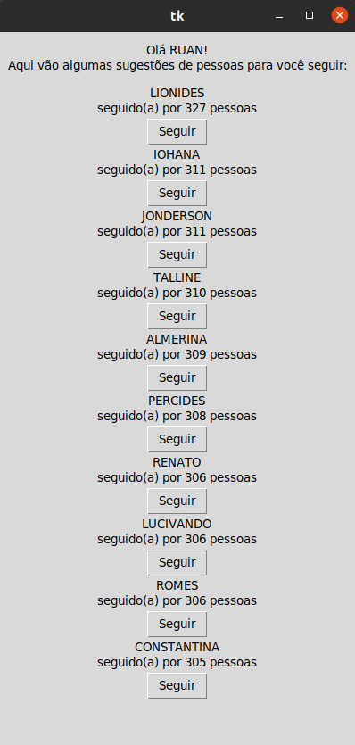
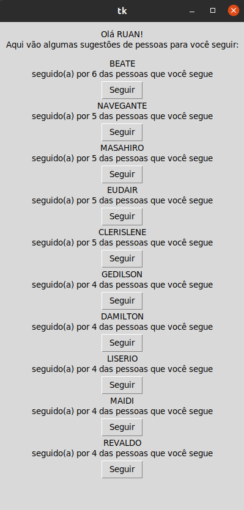

# FollowSuggestion

**Número da Lista**: 7 
**Conteúdo da Disciplina**: Grafos 1 

## Alunos
|Matrícula | Aluno |
| -- | -- |
| 18/0030272  |  Antonio Ruan Moura Barreto |
| xx/xxxxxxx  |  xxxx xxxx xxxxx |

## Sobre 
O objetivo do projeto é implementar um algoritmo que recomende pessoas para seguir de acordo com as pessoas que o usuario já siga, para isso nós utilizamos grafos. 

## Screenshots
 

## Instalação 
**Linguagem**: Python3 
É necessario somente o uso do python3. Com o python3 
execute o arquivo main. Caso venha ocorrer algum erro com o modulo tkinter, tente intalar o python3-tk.

## Uso 
Com o programa aberto, você deve escoler um nome de usuário, e em seguida lhe será mostrado uma lista com as 10 pessoas mais seguidas. Após você seguir alguem a lista se atualizara recomendando as pessas mais seguidas pelas pessas que você segue.
